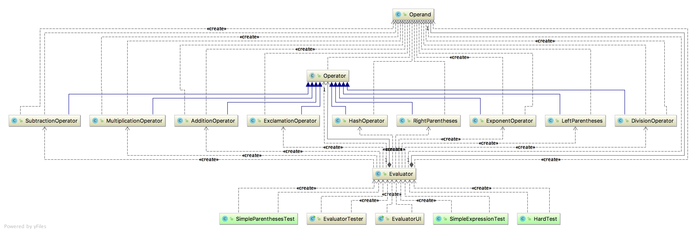
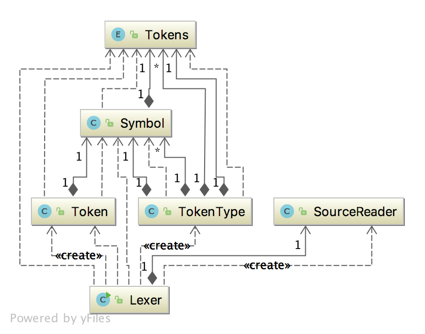
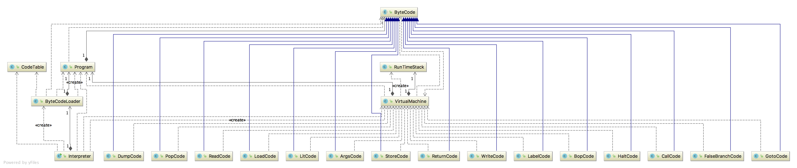
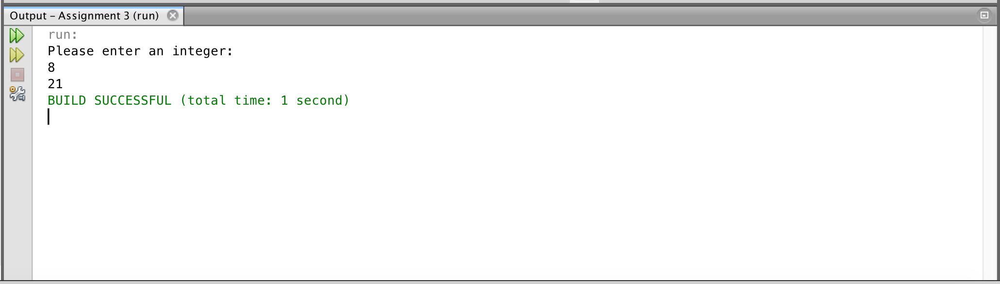
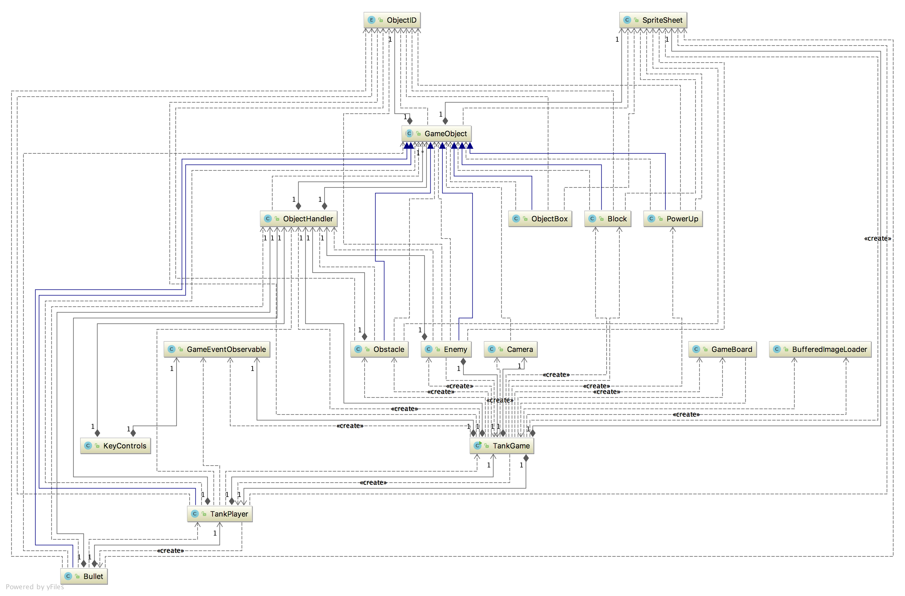

# CSC 413 Software Development class projects overview

In this repository, I've included all Java projects that I've done in CSC 413 Software Development class. We have been asked not to make the project's source code publicly available, therefore, here I'm only posting the project's gif demo and class diagrams.

# Assignment - 1, Calculator with UI 
This is a simple calculator built using Java.

The purpose of this assignment is to practice object-oriented design to create a Calculator
program that can evaluate mathematical expressions and has GUI that allows users to use the program and enter expressions. Main part of work Stack and HashMap usage along with connecting code to UI.
## Class Diagram

  


## Demo


# Assignment - 2, Lexer 

The purpose of this assignment is to extend the Lexer component of our x language compiler to be able to handle additional tokens, to supplement our understanding of Compilers and Lexical Analysis.


## Class Diagram

  

## Program's output running through a file which has code below

```
READLINE:   program { int i double j double k
program    Left: 0       Right: 6       Line : 1       
{          Left: 8       Right: 8       Line : 1       
int        Left: 10      Right: 12      Line : 1       
i          Left: 14      Right: 14      Line : 1       
double     Left: 16      Right: 21      Line : 1       
j          Left: 23      Right: 23      Line : 1       
double     Left: 25      Right: 30      Line : 1       
k          Left: 32      Right: 32      Line : 1       
READLINE:      k = i + j + 7
k          Left: 3       Right: 3       Line : 2       
=          Left: 5       Right: 5       Line : 2       
i          Left: 7       Right: 7       Line : 2       
+          Left: 9       Right: 9       Line : 2       
j          Left: 11      Right: 11      Line : 2       
+          Left: 13      Right: 13      Line : 2       
7          Left: 15      Right: 15      Line : 2       
READLINE:      if k > i then 
if         Left: 3       Right: 4       Line : 3       
k          Left: 6       Right: 6       Line : 3       
>          Left: 8       Right: 8       Line : 3       
i          Left: 10      Right: 10      Line : 3       
then       Left: 12      Right: 15      Line : 3       
READLINE:       { j = write(i) }
{          Left: 4       Right: 4       Line : 4       
j          Left: 6       Right: 6       Line : 4       
=          Left: 8       Right: 8       Line : 4       
write      Left: 10      Right: 14      Line : 4       
(          Left: 15      Right: 15      Line : 4       
i          Left: 16      Right: 16      Line : 4       
)          Left: 17      Right: 17      Line : 4       
}          Left: 19      Right: 19      Line : 4       
READLINE:      if k >= j then
if         Left: 3       Right: 4       Line : 5       
k          Left: 6       Right: 6       Line : 5       
>=         Left: 8       Right: 9       Line : 5       
j          Left: 11      Right: 11      Line : 5       
then       Left: 13      Right: 16      Line : 5       
READLINE:       { write(k) }
{          Left: 4       Right: 4       Line : 6       
write      Left: 6       Right: 10      Line : 6       
(          Left: 11      Right: 11      Line : 6       
k          Left: 12      Right: 12      Line : 6       
)          Left: 13      Right: 13      Line : 6       
}          Left: 15      Right: 15      Line : 6       
READLINE:   }
}          Left: 0       Right: 0       Line : 7       
null

1: program { int i double j double k
2:    k = i + j + 7
3:    if k > i then 
4:     { j = write(i) }
5:    if k >= j then
6:     { write(k) }
7: }
```


# Assignment - 3, The Interpreter

For this assignment we've implemented an interpreter for the mock language X. Some code has been given to us to get started.

## Class Diagram

  


## Code to interpret:
Fibonacci numbers, given in assignment for testing purposes 

```
GOTO start<<1>>
LABEL Read
READ
RETURN
LABEL Write
LOAD 0 dummyFormal
WRITE
RETURN
LABEL start<<1>>
LIT 0 x
GOTO continue<<3>>
LABEL fib<<2>>
LOAD 0 n
LIT 1
BOP <=
FALSEBRANCH else<<4>>
LIT 1
RETURN fib<<2>>
POP 0
GOTO continue<<5>>
LABEL else<<4>>
LOAD 0 n
LIT 2
BOP ==
FALSEBRANCH else<<6>>
LIT 1
RETURN fib<<2>>
POP 0
GOTO continue<<7>>
LABEL else<<6>>
LOAD 0 n
LIT 2
BOP -
ARGS 1
CALL fib<<2>>
LOAD 0 n
LIT 1
BOP -
ARGS 1
CALL fib<<2>>
BOP +
RETURN fib<<2>>
POP 0
LABEL continue<<7>>
POP 0
LABEL continue<<5>>
POP 0
LIT 0    GRATIS-RETURN-VALUE
RETURN fib<<2>>
LABEL continue<<3>>
LIT 0 k
LIT 5
STORE 0 x
ARGS 0
CALL Read
ARGS 1
CALL fib<<2>>
ARGS 1
CALL Write
STORE 1 k
LIT 0 x
LIT 7
STORE 2 x
LIT 8
STORE 2 x
POP 1
POP 2
HALT
```
## Output
  

# Assignment - 4, Tank Game

This is a tank game built using Java. A team of two worked on the project. It's the first of two final projects for the class.

The goal of this term project is to practice good OOP. The intended purpose of these two games, is for teams to implement the tank game, and then re-use a good portion of the first game to write the second game. This means the design and implementation of the first game must practice good OOP.REUSUABBILITY will be the focus of this term project. A more reusable game one will make implementing game two easier (relatively speaking). This also means choosing a different idea then listed in the second game options section will break this, requiring your team to implement two entirely
different games/code bases.

Our team chose completely different project for the second game option. Instead of another Java game we implemented cross-platform mobile app which can be found [here in different repo](https://github.com/jkhusanov/healthy-eats). However, as the project's requirement and to practice good OOP principles we've designed the tank game project in a way that if it's needed it can be used to implement different games.

## Class Diagram

  

## Demo 


#### IDE the project was made: **NetBeans IDE 8.2**

### The version of java used to build the game: **Java 8**

### Current working directory: **Master**

## How to run the game:
1. Download or clone the repo
2. Open NetBeans IDE
3. Go to **File** under drop down menu and select **Open Project**
4. Navigate to the directory where the repo is downloaded/cloned and when you see our repo name navigate into it
5. You will see Coffee icon with **TankGame** text, click on it and choose **Open Project**
6. The project will appear in your left side Projects Menu
7. You can double click on it and open Java class called *TankGame.java* 
8. Finally, to run the game press **Play** button **(Run Project)**. 
9. You should see the running game on your screen. Have fun while playing against zombie enemies!

## Key Controls

## First tank: 
### Movements: **W**, **A**, **S**, **D**
### Shoot: **Space**
## Second tank: 
### Movements: **Up**, **Down**, **Left**, **Right**
### Shoot: **Enter**

## Objective
Avoid losing health by killing the zombies. Powerup is additional ammo that is located throughout the map (a black and blue box). If either tank loses all 3 lives, they die and are removed from game.  If both tanks are dead, no more possible moves game over.

## TODO

- [x] Crete new project and push
- [x] Import resources
- [x] Game Board setup
    - [x] Game Board create
    - [x] Game Board load background image
    - [ ] Game board split to two screens --> Tried different ways to do it had difficulties to integrate changes with our custom map
    - [ ] Add mini map --> the same problem as with split screen
- [x] Game Objects setup
    - [x] Create Basic block objects
    - [x] Move Basic object with keyboard
    - [x] Fix The Bug in the Game that slowed our game ([used ArrayList instead of LinkedList](https://stackoverflow.com/questions/322715/when-to-use-linkedlist-over-arraylist))
    - [x] Powerups are added
- [x] Add a tank to the board 
    - [x] Add movements to the tank
    - [x] Create second Tank
    - [x] Move Second tank 
    - [x] Independent shooting is fixed; keeping track of bullets remaining
    - [x] Health bar added, zombie killed count and lives count
- [ ] :star: **Bonus:** Add Sound to the game (possible)
